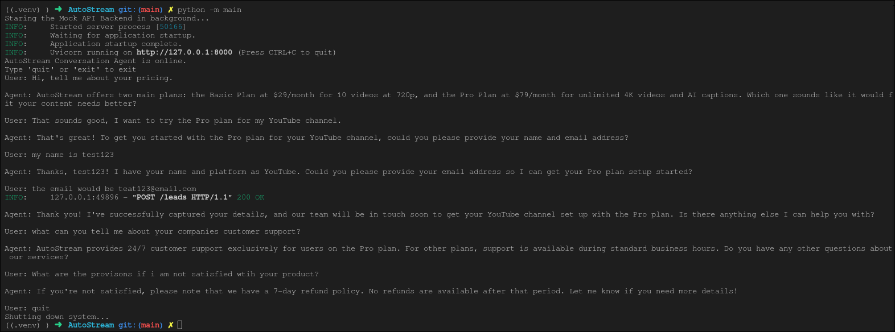

# AutoStream Converstional AI Agent

This is a demo of a conversational AI agent that can be used to answer questions about the AutoStream product and capture leads. It is built using LangGraph and demonstrates the use of LLMs for various tasks. Made as an intership assignment.

## Features

- RAG (Retrieval Augmented Generation)
- Tool Use
- Multi-turn Conversation
- Mock API Integration for Lead Capture

## Agent in Action

**Quick Glance:**


_Note: This screenshot demonstrates the agent's multi-turn memory, RAG-based pricing retrieval, and successful lead capture via the backend API._

**Video Demo:**
_(Click play to see the multi-turn context, RAG retrieval, and FastAPI database capture in real-time)._

https://github.com/user-attachments/assets/1a98ff86-6f4c-4030-b2ce-2ec00e6ea40d

## How to run locally

### 1. Clone the repository:

```bash
git clone https://github.com/Prateek-Kumar98217/AutoStream-Agent.git
cd AutoStream-Agent
```

### 2. Set up the environment:

```bash
python -m venv .venv
source .venv/bin/activate
pip install -r requirements.txt
```

### 3. Configure environment variables

Create a .env file in the root directory using the provided .env.example as a template and insert your Gemini API key.

### 4. Run data ingestion script to ingest the data into the vector store:

Run the data ingestion script to embed the markdown knowledge base into the local Chroma vector store.

```bash
python -m ingest
```

### 5. Run the main script to start the demo:

Launch the main script. This concurrently boots the FastAPI mock backend and the interactive LangGraph terminal loop.

```bash
python -m main
```

## Architecture

### Directories and Files

- **demo/**: The primary application directory.
  - **demo/core/rag.py**: Manages document ingestion, chunking, and the ChromaDB vector store.

  - **demo/core/database.py**: A lightweight SQLite wrapper for persisting captured leads.

  - **demo/core/prompt.py**: Contains the hardened system instructions and guardrails.

  - **demo/agent.py**: Defines the tools, state management, and the LangGraph routing logic.

  - **demo/api.py**: A FastAPI application providing the REST endpoints for lead capture.

- **data/**: Stores the raw knowledge_base/ files, the compiled Chroma database, and the SQLite leads database.

- **ingest.py**: A utility script for one-time vector store population.

- **main.py**: The entry point that orchestrates the backend thread and the user CLI.

- **basic/**: Contains the initial proof-of-concept iteration of the agent.

### Why LangGraph?

LangGraph was selected over standard LangChain or AutoGen because agentic workflows require highly deterministic routing. By defining the workflow as a cyclical graph, the LLM is constrained to specific nodes (reasoning vs. tool execution). This prevents the agent from spiraling into endless loops and ensures strict adherence to the lead-capture prerequisites.

**State Management**: State is managed via a custom MessageState dictionary that appends HumanMessage, AIMessage, and ToolMessage objects. Rather than manually passing massive history arrays on every loop, the graph utilizes LangGraph's MemorySaver checkpointer. By binding execution to a specific thread_id, the checkpointer natively tracks and persists the conversation history, easily fulfilling the multi-turn memory requirement.

**Intent Identification (Implicit Routing)**:
Rather than relying on rigid, traditional NLP classifiers (like regex matching) or a separate classification model, this architecture leverages the LLM's native reasoning combined with LangGraph's tool-binding to dynamically classify intent:

- **Casual Greeting**: Handled via standard conversational text generation without tool invocation.
- **Product/Pricing Inquiry**: Detected and dyn amically routed to the `retrieve_context` RAG tool.
- **High-Intent Lead**: Detected and gated by strict system prompt constraints, triggering the `capture_lead` tool only after all qualification requirements (Name, Email, Platform) are gathered.

**Model-Agnostic Design & API Versioning**:

The agent's architecture was designed to be highly robust and model-agnostic. While the original assignment prompt requested legacy models (such as gemini-1.5-flash), those specific API endpoints have been deprecated by Google. To ensure this project runs flawlessly on your machine without throwing 404 Model Not Found errors, the codebase has been upgraded to use the currently supported gemini-2.5-flash model. During development, the system constraints and state routing were also successfully tested against models like gemma-4-31b and gemini-flash-latest to verify the stability of the architecture.

## WhatsApp Deployment

The current structure is already designed considering event driven architecture in mind. So, integrating with WhatsApp webhooks and API will not be much of a task. The whole agent workflow can be invoked by a trigger from WhatsApp. Here is how I would proceed:-

1. Expose a public /webhook endpoint on the FastAPI server and register it with the Meta WhatsApp Business API.

2. When a user messages the AutoStream number, Meta sends an HTTP POST request to the webhook containing a JSON payload with the user's phone number and message body.

3. The FastAPI server parses the message string and invokes the LangGraph agent. The user's phone number is passed as the thread_id to the MemorySaver config, guaranteeing isolated conversational memory for every unique user.

4. Once the LangGraph cycle completes, the backend extracts the final AIMessage content and sends an HTTP POST request back to Meta's /messages endpoint to deliver the reply to the user's phone.
